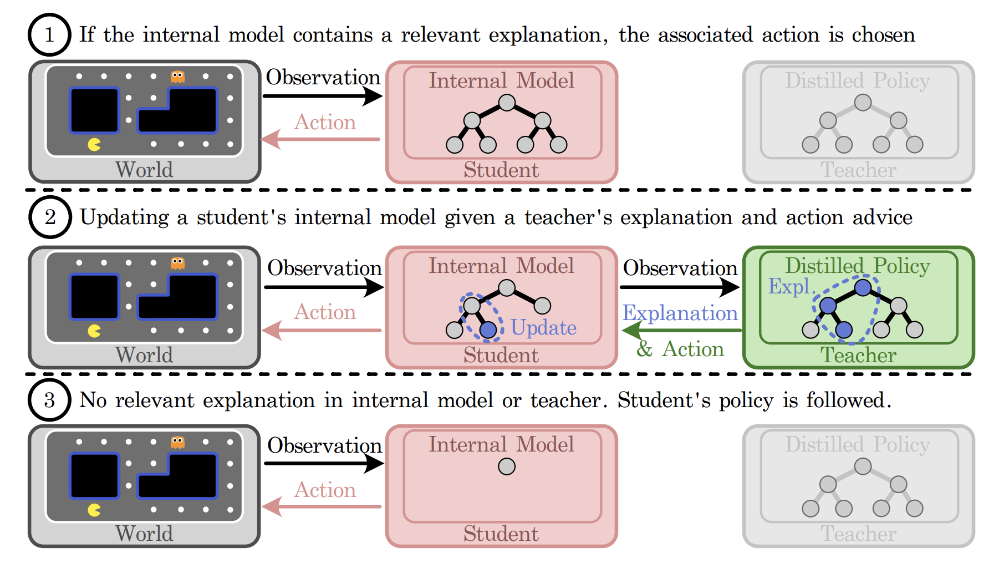

# Explainable Action Advising 

(accepted to ICRA 2023)

In this 3-minute video we explained with animations: 
+ [Video Demo](https://youtu.be/3FCJV9tp5tc)

See the paper of arxiv version here: 
+ [Explainable Action Advising for Multi-Agent Reinforcement Learning](https://arxiv.org/abs/2211.07882).

Explainable Action Advising allows the teacher agent to provide action advice as well as associated explanations indicating why the action was chosen. This allows the student to self-reflect on what it has learned, enabling advice generalization and leading to improved sample efficiency and learning performance. 

This repo augments the Teacher-Student framework of the action advising multi-agent reinforcement learning algorithms, implemented in Pytorch.

The major environment is a Urban Search and Rescue (USAR) mission including all experiments, with the MARL algorithm implemented in COMA.
The pacman environment is a single player mission, while the HFO is a MARL mission as well. We implemented our EAA algorithm and made comparisions with several benchmarks.


___

## USAR 

## Requirements

See `requirements.txt`.


## Quick Start

The repository contains 3 parts, including
(1) Train the expert teacher team.
(2) Use VIPER to replicate teacher's policy.
(3) Train the student team with EAA.

For each part, you can either train by yourself or use a pre-trained model that is saved.
To quickly examine the EAA algorithm with a saved example, run
```shell
python3 train.py --alg=coma
```
The default is EAA-Mistake Correcting, under the teacher advice of both NN and DT.
You will see a student after training with EAA.
Experiment parameters are in the `experiment_parameter.py` and there are other saved examples you may play with.

The `teacher_advice_strategy` must be one of the following:
- Early Advising
- Alternative Advising
- Importance Advising
- MistakeCorrect Advising

The `exp_type` must be one of the following:
- 1-dt+nn
- 2-no_advice_target
- 3-dt

Setting `allow_student_explpre_initially` and `always_take_advice = False` show different saved models as well.


## Run the Full Experiments

If you wish, you may also train each of the 3 parts from scratch.

(1) Train the expert teacher team.
Uncomment `teacher_advice_strategy = 'scratch'` and set `does_save_model ` to True in `experiment_parameter.py`, and run
```shell
$ python3 no_advice.py --alg=coma
```

(2) Using VIPER to replicate teacher's policy.
```shell
$ python3 viper.py --alg=coma
```
This outputs the Data file stored in `policy_extraction/D` directory.
Note that we have saved and renamed those results stored in `policy_extraction/VIPER_data`.


(3) Train the student.
Make sure `load_pretrain_saved_reults` is set to False in `experiment_parameter.py`, and run
```shell
$ python3 train.py --alg=coma
```

The default is the simple 4 room environment. Please be aware of the memory consuming if you run the scenario of 14 room.


## Acknowledgement
+ [StarCraft](https://github.com/starry-sky6688/StarCraft)


___

## Pacman

Standard student/teacher training:
```shell
$ python train.py --mode="train"
```

Evaluate the pytorch model saved in "trained_model.pth" over 50 episodes
```shell
$ python train.py --mode="debug" --import-path="trained_model.pth" --eval-episodes=50 --model-type="torch"
```

Evaluate the decision tree model saved in "distilled_tree.pickle"
```shell
$ python train.py --mode="evaluate" --import_path="distilled_tree.pickle" --eval-episodes=50 --model-type="tree"
```

Run viper with default arguments:
```shell
$ python viper.py --import-path="trained_model.pth"
```

## Acknowledgement
The code is adapted from the UC Berkeley CS188 Intro to AI, course material.
+ [The Pac-Man Projects](http://ai.berkeley.edu/project_overview.html)


___

## Half Field Offense (HFO)

The run code is the same as its originnal repo.
Please see its own README for reference.

## Acknowledgement
The environment is built from the environment of HFO, with SARSA implemented.
+ [HFO](https://github.com/LARG/HFO)


